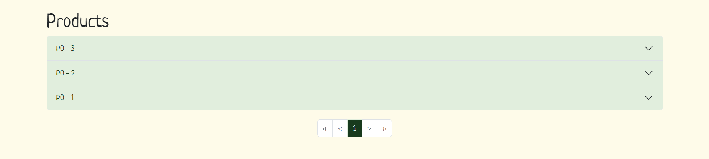

<div align="center">
    <h1 align='center'>⚡️<i>mvPurchaseOrders</i>⚡️</h1>
</div>

<details open="open">
<summary>
<h2 style="display:inline">📝 Table of Contents</h2>
</summary>

- [📑 About](#about)
- [📷 Screenshots](#feaScreenshotstures)
- [🏁 Getting started](#getting-started)
- [📂 Folder structure](#folder-structure)

</details>

---

## 📑 About

- Retrieve and display purchase order data in a user-friendly manner. The application parses the JSON and creates a list of clickable links, where each link represents a different purchase order. Clicking on a link expands a component that displays additional information about the selected purchase order, including the order's address, contact person, status, and order details.

## 📷 Screenshots

- 
- 
- 

## 🏁 Getting started

1. **_Clone the repository_**

```sh
$ git clone https://github.com/Abd-ELrahmanHamza/mvPurchaseOrders
```

2. **_Navigate to repository directory_**

```sh
$ cd mvPurchaseOrders
```

3. **_Install dependencies_**

```sh
$ npm install
```

### Running

**_Running on development mode_**

```sh
$ npm start
```

<details>
<summary>
  <h3 style="display:inline">Folder Structure </h3>
</summary>

```
├───Assets
│   └───Images
├───Components
│   ├───Banner
│   ├───CardItems
│   ├───ItemsContainer
│   ├───NavBar
│   ├───OrderDetails
│   ├───OrderMetaInfo
│   └───Paging
├───Data
├───Pages
│   └───Home
└───Theme
```

</details>
